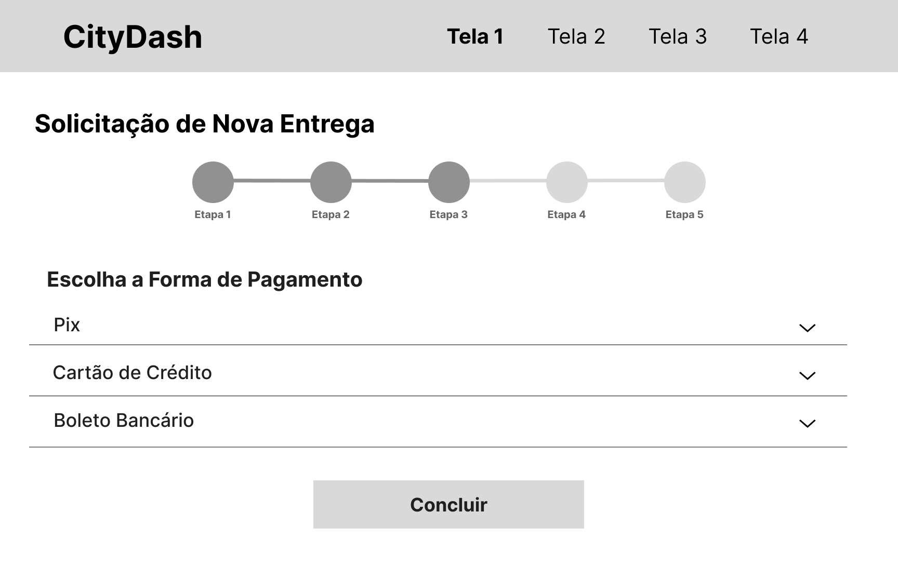

# Documento de Visão do Produto — CityDash

### Plataforma de Entregas Multicategoria

> **Disciplina:** Engenharia de Software  
> **Projeto:** Plataforma de Entregas Multicategoria (CityDash)  
> **Grupo:** Bruna Kinjo e Kayke Ahrens

---

## Sumário

1. [Visão Geral do Produto](#1-visão-geral-do-produto)
   - 1.1 [Oportunidade de Negócio e Declaração do Problema](#11-oportunidade-de-negócio-e-declaração-do-problema)
   - 1.2 [Perspectiva do Produto](#12-perspectiva-do-produto)
   - 1.3 [Capacidades do Produto](#13-capacidades-do-produto)
2. [Definição de Usuários](#2-definição-de-usuários)
3. [Restrições do Projeto](#3-restrições-do-projeto)
4. [Riscos do Projeto](#4-riscos-do-projeto)
5. [Referências](#5-referências)

---

## 1. Visão Geral do Produto

### 1.1 Oportunidade de Negócio e Declaração do Problema

#### Problema Principal

O mercado de entregas urbanas no Brasil enfrenta uma fragmentação significativa: de um lado, pessoas físicas e empresas precisam enviar documentos, pacotes e produtos com agilidade e rastreabilidade; do outro, há um grande contingente de motoboys e entregadores autônomos vinculados a cooperativas e transportadoras sem acesso a uma plataforma unificada de gestão e captação de demanda.

Segundo o ILOS (Instituto de Logística e Supply Chain), os custos logísticos no Brasil representaram 18,4% do PIB em 2023, equivalendo a cerca de R$ 1,95 trilhão, com estoques como principal driver e logística urbana impactada pelo e-commerce e entregas same-day. Apesar do crescimento, grande parte das pequenas empresas de entrega ainda opera via WhatsApp ou telefone, sem sistemas integrados de rastreamento, pagamento ou avaliação de qualidade. [[1]](#5-referências).

#### Causas do Problema

- Falta de plataformas acessíveis a pequenas e médias empresas de entrega;
- Ausência de rastreamento em tempo real para o cliente final;
- Processos manuais de despacho e precificação, gerando ineficiência operacional;
- Dificuldade dos entregadores autônomos em gerenciar rotas, ganhos e disponibilidade;
- Baixa confiabilidade percebida pelo cliente por falta de transparência no processo.

#### Oportunidade de Negócio

A CityDash se posiciona como uma plataforma B2B2C que conecta empresas de entrega (transportadoras, cooperativas de motoboys) a clientes finais, digitalizando toda a operação. O modelo de negócio pode operar via comissão por entrega realizada ou assinatura mensal pelas empresas de entrega cadastradas.

O segmento de last-mile delivery (última milha) é apontado pela McKinsey & Company como um dos de maior crescimento na logística global, com previsão de expansão de 78% até 2030 [[2]](#5-referências). No Brasil, o crescimento do comércio eletrônico e a proliferação de trabalhadores de plataforma criam um ambiente favorável para soluções como a CityDash.

#### Impacto Potencial

| Stakeholder         | Benefício                                                               |
| ------------------- | ----------------------------------------------------------------------- |
| Clientes            | Rastreamento em tempo real, preços transparentes, histórico de entregas |
| Entregadores        | Mais demanda organizada, gestão de ganhos, flexibilidade de horário     |
| Empresas de Entrega | Digitalização da operação, relatórios, gestão de equipe                 |
| Mercado             | Padronização e aumento de confiabilidade no setor de last-mile          |

---

### 1.2 Perspectiva do Produto

#### Contexto no Ecossistema Tecnológico

A CityDash se insere em um ecossistema onde soluções como iFood (para restaurantes), Rappi e Lalamove já exploram partes do mercado de entregas urbanas. No entanto, essas plataformas são majoritariamente focadas em nichos específicos (alimentação, grandes volumes) ou cobram altas comissões que inviabilizam pequenas transportadoras.

A CityDash se diferencia ao permitir que qualquer empresa de entrega — independente do porte — cadastre sua própria operação na plataforma, com regras de precificação e regiões personalizáveis. Isso a aproxima de um modelo de "marketplace de logística" voltado para o mercado urbano brasileiro.

#### Público-Alvo

- **Clientes finais (pessoas físicas e jurídicas):** que precisam enviar ou receber itens de forma rápida, rastreável e confiável.
- **Empresas de entrega:** transportadoras, cooperativas de motoboys e empresas de logística que buscam digitalizar suas operações.
- **Entregadores:** profissionais autônomos ou contratados que executam as entregas e precisam de organização de rotas e ganhos.

#### Proposta de Valor

> "Conectar quem precisa enviar a quem pode entregar — com rastreamento, transparência e confiança."

A CityDash entrega:

- Para o **cliente:** uma experiência simples, com estimativa de preço, rastreamento em tempo real e avaliação do serviço.
- Para o **entregador:** uma ferramenta para gerenciar disponibilidade, aceitar corridas e visualizar ganhos.
- Para a **empresa de entrega:** um painel completo de gestão operacional e financeira.

---

### 1.3 Capacidades do Produto

#### Principais Funcionalidades

| #   | Funcionalidade                                    | Benefício                                  |
| --- | ------------------------------------------------- | ------------------------------------------ |
| 1   | Cadastro de empresas de entrega e entregadores    | Estrutura multiempresa na plataforma       |
| 2   | Solicitação de entrega com coleta e destino       | Experiência simples para o cliente         |
| 3   | Cálculo automático de frete por distância         | Precificação transparente e justa          |
| 4   | Entrega imediata ou agendada                      | Flexibilidade para diferentes necessidades |
| 5   | Despacho automático para entregadores disponíveis | Eficiência operacional                     |
| 6   | Rastreamento em tempo real via GPS                | Transparência e segurança para o cliente   |
| 7   | Confirmação de recebimento                        | Ciclo de entrega auditável                 |
| 8   | Avaliação do entregador                           | Incentivo à qualidade do serviço           |
| 9   | Histórico de entregas                             | Consulta e gestão para clientes            |
| 10  | Relatórios e repasse financeiro                   | Gestão para empresas de entrega            |

## Wireframes de Baixíssima Resolução

### Fluxo do Cliente

#### 1. Solicitar Entrega

---

#### 2. Cálculo de Frete

---

#### 3. Pagamento

---

#### 4. Acompanhar Entregador

---

#### 5. Confirmar Entrega

### Fluxo do Entregador

#### 1. Cadastrar Nova Empresa

---

#### 2. Gerenciar Entregadores

---

#### 3. Gerenciar Empresa

### Painel do Administrador da Empresa

#### 1. Informações do Entregador

---

**Link Figma** 
https://www.figma.com/design/NbZToBfspcUbY72wqLeE61/Wireframes---Engenharia-de-Software?node-id=0-1&t=gwryhG4y99lz4UUB-1

#### Características de Qualidade

- **Usabilidade:** Interface intuitiva, fluxo de solicitação em no máximo 3 telas, acessível a usuários com baixa familiaridade tecnológica.
- **Segurança:** Autenticação com login e senha; dados pessoais de clientes e entregadores protegidos por perfil de acesso; dados sensíveis não expostos entre partes.
- **Confiabilidade:** Alta disponibilidade, pois entregas podem ser solicitadas a qualquer hora do dia.
- **Manutenibilidade:** Arquitetura organizada em módulos (clientes, entregadores, empresas, pagamentos) para facilitar evoluções futuras.
- **Desempenho:** Rastreamento em tempo real com atualização de localização em intervalos de até 10 segundos.

---

## 2. Definição de usuários

### USER-001 — Cliente

| Atributo                  | Descrição                                                                                                                                                           |
| ------------------------- | ------------------------------------------------------------------------------------------------------------------------------------------------------------------- |
| **Usuário ID**            | USER-001                                                                                                                                                            |
| **Nome do Perfil**        | Cliente                                                                                                                                                             |
| **Descrição**             | Pessoa física ou jurídica que solicita entregas pela plataforma. Pode ser um consumidor final, um lojista ou qualquer pessoa que precise enviar ou receber um item. |
| **Experiência Técnica**   | Baixa a média; familiaridade com aplicativos de smartphone (ex.: apps de transporte ou delivery).                                                                   |
| **Frequência de Uso**     | Variável; pode ser esporádico (uma vez por semana) ou recorrente (diário, no caso de lojistas).                                                                     |
| **Principais Objetivos**  | Solicitar entregas de forma rápida, acompanhar o status em tempo real e receber o item com segurança.                                                               |
| **Desafios**              | Incerteza sobre prazo e valor; dificuldade em rastrear entregas sem sistema adequado.                                                                               |
| **Restrições**            | Acessa apenas suas próprias solicitações; não visualiza dados pessoais do entregador além do necessário.                                                            |
| **Requisitos Principais** | Fluxo simples de solicitação, estimativa de preço e tempo, rastreamento em tempo real, histórico de pedidos.                                                        |

---

### USER-002 — Entregador

| Atributo                  | Descrição                                                                                                                                |
| ------------------------- | ---------------------------------------------------------------------------------------------------------------------------------------- |
| **Usuário ID**            | USER-002                                                                                                                                 |
| **Nome do Perfil**        | Entregador                                                                                                                               |
| **Descrição**             | Profissional (autônomo ou contratado) vinculado a uma empresa de entrega cadastrada na plataforma. Realiza a coleta e entrega dos itens. |
| **Experiência Técnica**   | Baixa a média; familiaridade com GPS e aplicativos de navegação.                                                                         |
| **Frequência de Uso**     | Alta; uso contínuo durante o turno de trabalho.                                                                                          |
| **Principais Objetivos**  | Receber e aceitar ofertas de entrega, atualizar o status das corridas e acompanhar seus ganhos.                                          |
| **Desafios**              | Conectividade em regiões com sinal fraco de internet; encontrar endereços de difícil localização.                                        |
| **Restrições**            | Visualiza apenas informações necessárias para a entrega; não acessa dados pessoais completos do cliente.                                 |
| **Requisitos Principais** | Notificações de novas ofertas, navegação integrada, atualização de status simplificada, painel de ganhos.                                |

---

### USER-003 — Administrador da Empresa de Entrega

| Atributo                  | Descrição                                                                                                                               |
| ------------------------- | --------------------------------------------------------------------------------------------------------------------------------------- |
| **Usuário ID**            | USER-003                                                                                                                                |
| **Nome do Perfil**        | Administrador da Empresa de Entrega                                                                                                     |
| **Descrição**             | Gestor responsável por cadastrar e gerenciar a empresa de entrega na plataforma, incluindo equipe, preços e relatórios.                 |
| **Experiência Técnica**   | Média a alta; familiaridade com sistemas de gestão e planilhas.                                                                         |
| **Frequência de Uso**     | Regular; acessa diariamente para monitorar operação e entregadores.                                                                     |
| **Principais Objetivos**  | Gerenciar entregadores, definir preços e regiões de atuação, acompanhar relatórios financeiros e operacionais.                          |
| **Desafios**              | Controle de entregadores em campo; gestão de repasses e pagamentos; monitoramento da qualidade do serviço.                              |
| **Restrições**            | Gerencia apenas sua própria empresa; não acessa dados de outras empresas cadastradas.                                                   |
| **Requisitos Principais** | Painel de gestão da empresa, cadastro de entregadores, configuração de precificação por região, relatórios de desempenho e financeiros. |

---

## 3. Restrições do Projeto

| Campo                        | Descrição                                                                                                                                                                                                                                                                           |
| ---------------------------- | ----------------------------------------------------------------------------------------------------------------------------------------------------------------------------------------------------------------------------------------------------------------------------------- |
| **Restrição ID**             | NF-CONST-001                                                                                                                                                                                                                                                                        |
| **Título**                   | Restrições Tecnológicas                                                                                                                                                                                                                                                             |
| **Descrição**                | O sistema deve integrar obrigatoriamente com uma API de mapas (ex.: Google Maps Platform ou OpenStreetMap/OSRM) para cálculo de distâncias e rastreamento em tempo real, e com um gateway de pagamentos (ex.: Stripe, PagSeguro ou Mercado Pago) para processamento das transações. |
| **Origem**                   | Requisitos do sistema (seção 6 do estudo de caso)                                                                                                                                                                                                                                   |
| **Critérios de verificação** | a. Integração com API de mapas funcional e testada; b. Integração com gateway de pagamentos operacional em ambiente de produção.                                                                                                                                                    |
| **Relacionamento**           | RF03, RF04, RF07                                                                                                                                                                                                                                                                    |

| Campo                        | Descrição                                                                                                                                                              |
| ---------------------------- | ---------------------------------------------------------------------------------------------------------------------------------------------------------------------- |
| **Restrição ID**             | NF-CONST-002                                                                                                                                                           |
| **Título**                   | Capacidade e Escalabilidade                                                                                                                                            |
| **Descrição**                | O sistema deve suportar entre 1.000 e 5.000 usuários ativos por mês e um volume estimado de 15.000 entregas no primeiro ano de operação, sem degradação de desempenho. |
| **Origem**                   | Requisitos não-funcionais do estudo de caso                                                                                                                            |
| **Critérios de verificação** | a. Testes de carga com simulação de pico de acessos simultâneos; b. Tempo de resposta das telas críticas inferior a 3 segundos.                                        |
| **Relacionamento**           | RF06, RF07                                                                                                                                                             |

| Campo                        | Descrição                                                                                                                    |
| ---------------------------- | ---------------------------------------------------------------------------------------------------------------------------- |
| **Restrição ID**             | NF-CONST-003                                                                                                                 |
| **Título**                   | Disponibilidade                                                                                                              |
| **Descrição**                | O sistema deve estar disponível 24 horas por dia, 7 dias por semana, pois entregas podem ser solicitadas a qualquer momento. |
| **Origem**                   | Requisitos não-funcionais do estudo de caso                                                                                  |
| **Critérios de verificação** | a. SLA de disponibilidade mínima de 99%; b. Monitoramento automatizado com alertas em caso de indisponibilidade.             |
| **Relacionamento**           | RF03, RF05, RF06                                                                                                             |

---

| Campo                        | Descrição                                                                                                                                                                                                                                                                                   |
| ---------------------------- | ------------------------------------------------------------------------------------------------------------------------------------------------------------------------------------------------------------------------------------------------------------------------------------------- |
| **Restrição ID**             | NF-CONST-004                                                                                                                                                                                                                                                                                |
| **Título**                   | Conformidade com a LGPD                                                                                                                                                                                                                                                                     |
| **Descrição**                | O sistema deve estar em conformidade com a Lei Geral de Proteção de Dados (Lei nº 13.709/2018), garantindo o tratamento adequado dos dados pessoais de clientes e entregadores, coleta apenas dos dados necessários (minimização), e mecanismos para exclusão de dados a pedido do titular. |
| **Origem**                   | LGPD — Lei nº 13.709/2018 [[3]](#5-referências)                                                                                                                                                                                                                                             |
| **Critérios de verificação** | a. Política de privacidade publicada e acessível; b. Consentimento explícito coletado no cadastro; c. Dados sensíveis armazenados com criptografia.                                                                                                                                         |
| **Relacionamento**           | USER-001, USER-002                                                                                                                                                                                                                                                                          |

| Campo                        | Descrição                                                                                                                                                                                                                                                                                                                                                |
| ---------------------------- | -------------------------------------------------------------------------------------------------------------------------------------------------------------------------------------------------------------------------------------------------------------------------------------------------------------------------------------------------------- |
| **Restrição ID**             | NF-CONST-005                                                                                                                                                                                                                                                                                                                                             |
| **Título**                   | Regulamentação de Motoboys e Entregadores                                                                                                                                                                                                                                                                                                                |
| **Descrição**                | A plataforma deve estar ciente das regulamentações trabalhistas aplicáveis a entregadores de plataformas digitais no Brasil, incluindo as discussões em andamento sobre vínculo empregatício e direitos previdenciários (PL 3.748/2020 e legislação correlata). A responsabilidade legal pela relação de trabalho é das empresas de entrega cadastradas. |
| **Origem**                   | PL 3.748/2020; discussões regulatórias em curso no Brasil [[4]](#5-referências)                                                                                                                                                                                                                                                                          |
| **Critérios de verificação** | a. Termos de uso da plataforma com clara definição das responsabilidades das empresas de entrega; b. Conformidade com legislação vigente no momento do lançamento.                                                                                                                                                                                       |
| **Relacionamento**           | USER-002, USER-003                                                                                                                                                                                                                                                                                                                                       |

---

## 4. Riscos do projeto

| Campo                     | Descrição                                                                                                                                                                       |
| ------------------------- | ------------------------------------------------------------------------------------------------------------------------------------------------------------------------------- |
| **ID do Risco**           | RISCO-001                                                                                                                                                                       |
| **Descrição**             | Ausência de entregadores disponíveis na região solicitada pelo cliente.                                                                                                         |
| **Categoria**             | Operacional                                                                                                                                                                     |
| **Probabilidade**         | Alta                                                                                                                                                                            |
| **Impacto**               | Alto                                                                                                                                                                            |
| **Ação de Mitigação**     | Implementar sistema de notificação que alerta entregadores de regiões próximas; exibir ao cliente estimativa de espera ou ausência de cobertura antes de confirmar o pagamento. |
| **Plano de Contingência** | Permitir agendamento da entrega para um horário de maior disponibilidade; oferecer lista de empresas parceiras alternativas.                                                    |

---

| Campo                     | Descrição                                                                                                                                             |
| ------------------------- | ----------------------------------------------------------------------------------------------------------------------------------------------------- |
| **ID do Risco**           | RISCO-002                                                                                                                                             |
| **Descrição**             | Imprecisão no rastreamento GPS do entregador, comprometendo o acompanhamento em tempo real.                                                           |
| **Categoria**             | Técnico                                                                                                                                               |
| **Probabilidade**         | Média                                                                                                                                                 |
| **Impacto**               | Médio                                                                                                                                                 |
| **Ação de Mitigação**     | Utilizar APIs de mapas com suporte a fallback (ex.: triangulação de rede); implementar atualização de status manual pelo entregador como alternativa. |
| **Plano de Contingência** | Exibir último status conhecido ao cliente; notificar cliente sobre instabilidade no rastreamento.                                                     |

---

| Campo                     | Descrição                                                                                                                                    |
| ------------------------- | -------------------------------------------------------------------------------------------------------------------------------------------- |
| **ID do Risco**           | RISCO-003                                                                                                                                    |
| **Descrição**             | Destinatário ausente no endereço de entrega, impossibilitando a conclusão da corrida.                                                        |
| **Categoria**             | Operacional                                                                                                                                  |
| **Probabilidade**         | Média                                                                                                                                        |
| **Impacto**               | Alto                                                                                                                                         |
| **Ação de Mitigação**     | Enviar notificação ao cliente antes da chegada do entregador; permitir que o cliente informe um ponto de entrega alternativo.                |
| **Plano de Contingência** | Definir política clara de tentativas (ex.: 2 tentativas antes de devolução); cobrar taxa de retorno conforme política da empresa de entrega. |

---

| Campo                     | Descrição                                                                                                                                             |
| ------------------------- | ----------------------------------------------------------------------------------------------------------------------------------------------------- |
| **ID do Risco**           | RISCO-004                                                                                                                                             |
| **Descrição**             | Disputas entre cliente e entregador por item danificado ou não entregue.                                                                              |
| **Categoria**             | Operacional / Legal                                                                                                                                   |
| **Probabilidade**         | Média                                                                                                                                                 |
| **Impacto**               | Alto                                                                                                                                                  |
| **Ação de Mitigação**     | Exigir foto da coleta e da entrega pelo entregador; registrar histórico completo de status com timestamps.                                            |
| **Plano de Contingência** | Criar fluxo de disputa na plataforma com canal de suporte dedicado; definir política de reembolso parcial ou total conforme responsabilidade apurada. |

---

| Campo                     | Descrição                                                                                                                                                                                                    |
| ------------------------- | ------------------------------------------------------------------------------------------------------------------------------------------------------------------------------------------------------------ |
| **ID do Risco**           | RISCO-005                                                                                                                                                                                                    |
| **Descrição**             | Mudanças regulatórias no Brasil sobre relação de trabalho de entregadores de plataforma.                                                                                                                     |
| **Categoria**             | Legal / Externo                                                                                                                                                                                              |
| **Probabilidade**         | Alta                                                                                                                                                                                                         |
| **Impacto**               | Alto                                                                                                                                                                                                         |
| **Ação de Mitigação**     | Monitorar legislação em andamento; manter assessoria jurídica especializada; estruturar os termos da plataforma de forma que a responsabilidade trabalhista recaia sobre as empresas de entrega cadastradas. |
| **Plano de Contingência** | Adaptar modelo de negócio e contratos conforme eventuais novas exigências legais.                                                                                                                            |

---

## 5. Referências

[1] ILOS — Instituto de Logística e Supply Chain. _Custos logísticos atingem 18,4% do PIB em 2023_. Disponível em:
https://abolbrasil.org.br/noticias/noticias-do-setor/custos-logisticos-no-brasil-atingem-184-do-pib-em-2023. Acesso em: 13 mar. 2026

[2] WORLD ECONOMIC FORUM; McKINSEY & COMPANY. _The Future of the Last-Mile Ecosystem_. Janeiro 2020. Disponível em: https://www3.weforum.org/docs/WEF_Future_of_the_last_mile_ecosystem.pdf. Acesso em: 13 mar. 2026.

[3] BRASIL. _Lei nº 13.709, de 14 de agosto de 2018 — Lei Geral de Proteção de Dados Pessoais (LGPD)_. Disponível em: https://www.planalto.gov.br/ccivil_03/_ato2015-2018/2018/lei/l13709.htm. Acesso em: 13 mar. 2026.

[4] BRASIL. _Projeto de Lei nº 3.748/2020 — Estabelece condições de trabalho nas atividades de entrega de produtos ou serviços por via de plataformas digitais_. Câmara dos Deputados. Disponível em: https://www.camara.leg.br/proposicoesWeb/fichadetramitacao?idProposicao=2257468. Acesso em: 13 mar. 2026.

[5] McKINSEY & COMPANY. _Technology delivered: Implications for cost, customers, and competition in the last-mile ecosystem_. Agosto 2018. Disponível em: https://www.mckinsey.com/industries/logistics/our-insights/technology-delivered-implications-for-cost-customers-and-competition-in-the-last-mile-ecosystem. Acesso em: 13 mar. 2026.
